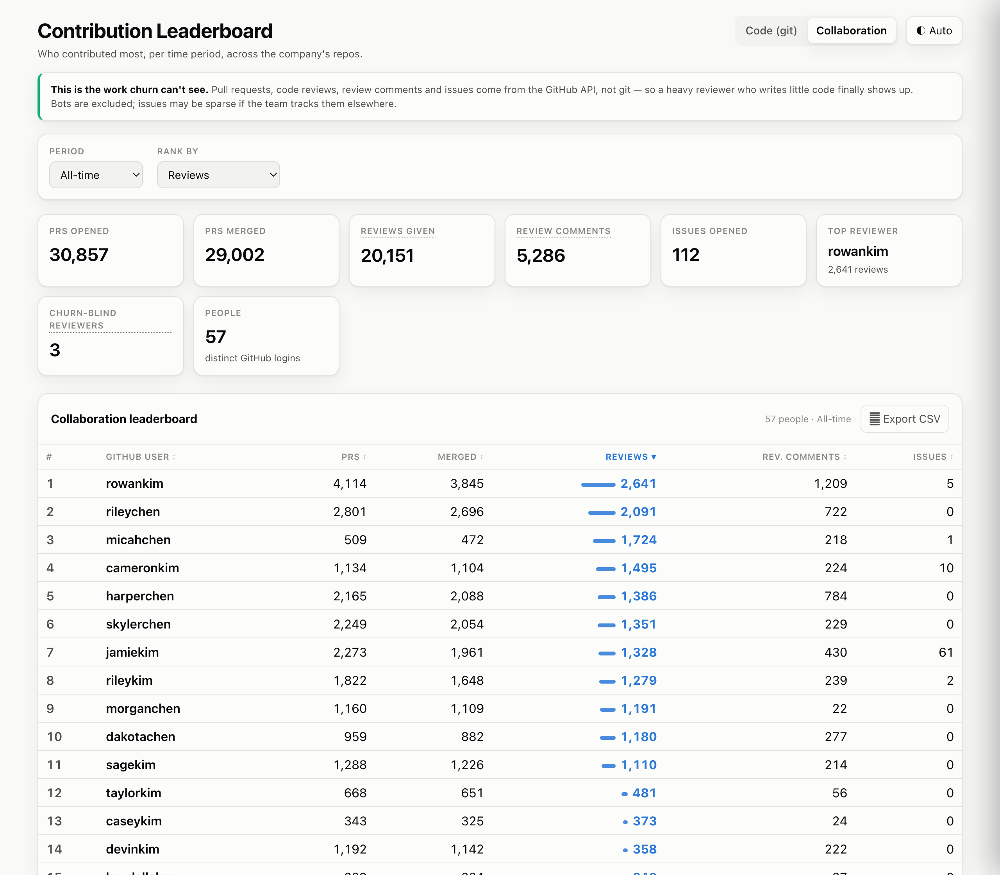
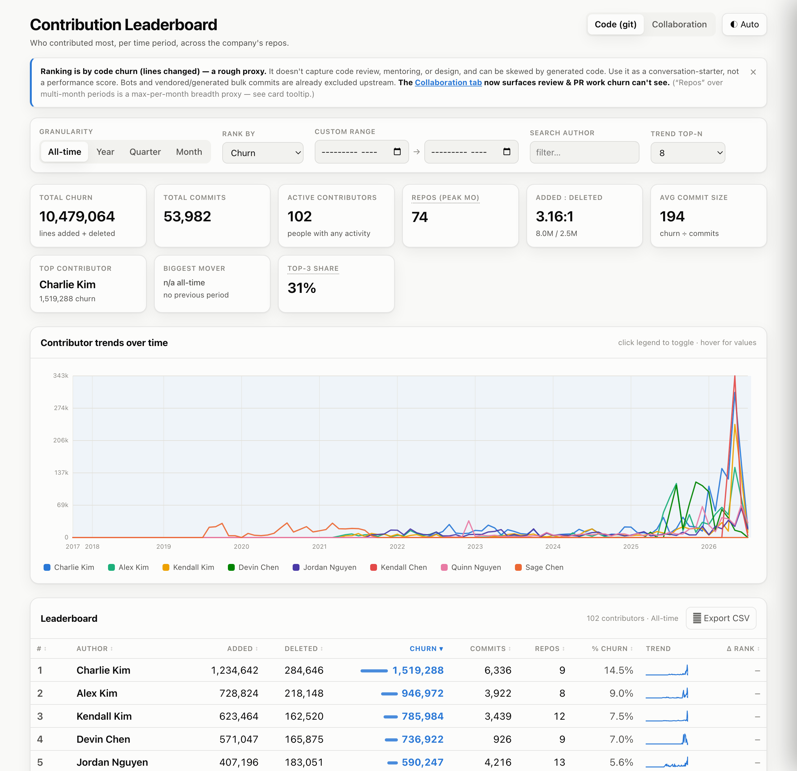

# 🏆 gitpodium

**Who actually wrote the code?** Point gitpodium at your GitHub orgs, and it clones
every repo, walks *every branch of the full history*, untangles the fact that one human
commits under five different emails, throws out the vendored-dump commits that would
otherwise crown a bot — and bakes the result into a single, shareable `report.html`.

No dashboard to host. No account to create. No data leaves your machine. One HTML file
you can double-click, email, or drop in Slack.

**gitpodium is meant to be driven by your AI agent, not run by hand.** Install it as a
skill (Claude Code, Codex, OpenCode — see below) and just ask:

> *"Who contributed most across our GitHub org this year?"*

The agent checks your GitHub CLI login, asks what to audit (which orgs, which metric,
what to filter out, where to put the report), then clones, dedups, and hands you a
`report.html`. The commands below are what it runs under the hood — you can also run
them yourself.

---

> ### ⚠️ Read this first: churn is not contribution
> gitpodium ranks by **lines added + deleted**, because that's the only signal git gives
> you with a time axis. But code review, mentoring, design, debugging, and the hard
> conversation that saved a week of work are all **invisible to git**. Squash-merged and
> deleted branches are gone forever. Treat the leaderboard as a **conversation-starter,
> never a stack-rank or a performance metric.** The report itself says so, at the top,
> every time. This honesty is a feature, not a disclaimer.

---

## What you get

A self-contained `report.html` with:

- **Per-month / quarter / year** leaderboards — scrub through time.
- **Per-person trend charts** — see when someone ramped up or went quiet.
- **Repo spread** — one-repo specialist vs. someone who touches everything.
- **Collaboration tab** *(GitHub)* — PRs opened/merged, code reviews, review comments,
  and issues per GitHub user. This is the review & PR work churn *can't* see: a heavy
  reviewer who writes little code finally shows up as a top contributor.
- **Light / dark theme**, keyboard-navigable, works offline from `file://`.

Plus the raw `monthly.csv`, `contrib-commits.tsv`, and `github.json` if you want to slice
it yourself.

### The two views

**Collaboration tab** — PRs, code reviews, review comments and issues per GitHub user.
Note `micahchen`: **509 PRs but 1,724 reviews** — a heavy reviewer a churn leaderboard would
badly underrate. The *Churn-blind reviewers* card counts people who review but open no PRs.



**Code (git) tab** — churn leaderboard with per-contributor trends over time:



<sub>Names and logins shown are anonymized sample data.</sub>

## Why it's not just `git shortlog`

| Problem | gitpodium |
|---|---|
| One person, many git emails | Auto-merges by shared email + normalized name; optional manual overrides |
| Vendored / generated dumps (Odoo, `dist/`, lockfiles) inflate a "winner" | Path excludes **and** a per-commit `MAXCHURN`/`MAXFILES` cap, with a transparency line showing exactly what got dropped |
| Bots (`dependabot`, CI, AI agents) top the chart | `*[bot]` + configurable non-human filter |
| Only `main` is counted | Walks `--all` refs, dedups shared commits |
| Many repos across an org | Clones the whole org (or user) in parallel, one pass |
| Reviews, PRs, and issues never touch git | Optional **Collaboration tab** pulls PRs / reviews / review-comments / issues per GitHub login straight from the API |
| "Just give me a link to share" | Data is **baked into** the HTML — one file, no server |

## Install — copy this to your coding agent

The easiest way: paste this prompt into **Claude Code, Codex, or OpenCode** and let it
install itself. No manual steps.

```text
Install the "gitpodium" skill for yourself:
1. Clone https://github.com/quangtran88/gitpodium into a stable location (e.g. ~/tools/gitpodium).
2. Wire it in as a skill for whatever coding agent you are:
   - Claude Code    -> symlink the repo dir to ~/.claude/skills/gitpodium
   - Codex/OpenCode -> make sure you load its AGENTS.md (add the repo to the project, or point your config at it)
3. Read its SKILL.md so you know the workflow, then tell me it's ready and how to invoke it.
gitpodium clones GitHub orgs and ranks contributors across all branches of full history
into one shareable, self-contained HTML leaderboard.
```

Once installed, just ask: *"Audit contributions across my acme-inc org, rank by commits."*
The agent checks your `gh` login, interviews you for scope/metric/filters/output, runs the
pipeline, and hands you `report.html` — surfacing the *churn ≠ contribution* caveat.

<details>
<summary>Prefer to install manually?</summary>

```bash
git clone https://github.com/quangtran88/gitpodium.git ~/tools/gitpodium
# Claude Code — SKILL.md is auto-discovered from the skills dir:
ln -s ~/tools/gitpodium ~/.claude/skills/gitpodium
# Codex / OpenCode — they read AGENTS.md; point the agent at the repo
# or copy AGENTS.md into your project.
```
</details>

## Run it yourself (what the agent runs under the hood)

**Prerequisites:** [`gh`](https://cli.github.com) (run `gh auth status`), plus `git`,
`python3`, `bash`, `awk` — all standard on macOS/Linux.

```bash
git clone https://github.com/quangtran88/gitpodium.git
cd some-empty-working-dir           # artifacts land in the current directory

# one shot: clone → dedup → collect → rollup → report.html
/path/to/gitpodium/gitpodium run acme-inc acme-labs
open report.html
```

`<owner>` can be a GitHub **org or a user**. Re-run any time — clones update in place.

### Or drive it step by step

```bash
gitpodium clone acme-inc acme-labs                 # → ./clones/   (idempotent)
gitpodium mailmap                                  # → ./.mailmap  (identity dedup)
gitpodium collect                                  # → ./contrib-commits.tsv (all branches)
gitpodium rollup                                   # → ./monthly.json + monthly.csv
gitpodium github acme-inc acme-labs                # → ./github.json (PRs/reviews/issues; gh API)
gitpodium report                                   # → ./report.html (self-contained)

gitpodium rank                                     # console leaderboard, all-time
gitpodium rank 2025-01-01 2025-12-31 quarter       # windowed + bucketed
```

## How it works

```
 GitHub orgs/users
        │  gh repo list + clone --all           clone-all.sh
        ▼
   ./clones/*                                    (full history, every branch)
        │  git log --all --pretty (name+email)   build-mailmap.py
        ▼
   ./.mailmap                                    (1 person ⇒ 1 identity)
        │  git log --all --numstat --use-mailmap collect.sh
        ▼
   contrib-commits.tsv                           (1 row / commit, author-dated)
        │  filter bots + bulk, aggregate         rollup.sh
        ▼
   monthly.json  ─────────────┐
                              ├──▶ build-report.py ──▶ report.html
   github.json  ──────────────┘     (embeds both)      (self-contained, shareable)
        ▲
        └─ gh api graphql: PRs · reviews · review comments · issues   collect-github.py
```

The `github.json` branch is **optional and additive** — skip it (or run against non-GitHub
repos) and you still get the full git-churn report; the Collaboration tab just won't appear.

Everything writes to your **current directory** (override with `GITPODIUM_OUT`). Nothing
is written back into the install folder, so you can keep it read-only on your `PATH`.

## Configuration

Drop a `gitpodium.config.sh` in your working dir (auto-sourced) — see
[`examples/gitpodium.config.sh`](examples/gitpodium.config.sh):

| Env var | Default | What it does |
|---|---|---|
| `GITPODIUM_ORGS` | — | Owners for `gitpodium run` with no args |
| `GITPODIUM_METRIC` | `churn` | Default metric in the report: `churn`/`commits`/`added`/`deleted`/`net`/`repos` (viewers can still switch live) |
| `MAXCHURN` | `10000` | Drop a commit whose added+deleted exceeds this (vendored dumps). `0` = off |
| `MAXFILES` | `400` | Drop a commit touching more files than this. `0` = off |
| `DROP_BOTS` | `1` | Exclude `*[bot]` accounts (git churn **and** GitHub reviewers/authors: any GraphQL `Bot`-type actor, `*[bot]`, or `extra_bots`) |
| `GITPODIUM_SKIP_GITHUB` | `0` | `1` skips the API-based Collaboration step in `run` (e.g. non-GitHub repos, or to save rate limit) |
| `GITPODIUM_IDENTITY` | — | JSON of manual identity merges + `extra_bots` — see [`examples/gitpodium.identity.json`](examples/gitpodium.identity.json) |
| `GITPODIUM_CLONES` | `./clones` | Reuse an existing clone mirror |
| `GITPODIUM_OUT` | `.` | Where artifacts are written |

**Identity overrides** — when auto-dedup can't tell that `jane` and `jane-doe-corp` are
the same person, or you want to pin a display name:

```json
{
  "force_merge": [["janedoe", "janedoecorp"]],
  "canonical_override": { "acmebot": ["Jane Doe", "jane@acme.com"] },
  "extra_bots": ["ci-runner", "release-bot"]
}
```

`gitpodium mailmap` also writes `mailmap-review.md` listing low-confidence guesses
(one name is a prefix of another) it left **un**merged for you to confirm.

## Limitations

- Churn is a proxy, not truth — see the caveat above. Really. Read it again.
- Binary files and the excluded paths (vendor, `dist/`, lockfiles, minified) don't count.
- Rewritten history / force-pushes reflect whatever's currently reachable.
- Private repos need your `gh` token to have access.
- The **Collaboration tab** needs the GitHub API (only GitHub-hosted repos your `gh` token
  can see) and is subject to the GraphQL rate limit. Issues may be sparse if the team
  tracks them in Jira/Linear instead — the report says so when the count is zero. It's
  keyed by **GitHub login**, which is a different identity space from the git author names
  in the churn view, so the two tabs are shown side by side rather than merged.

## License

MIT © 2026 Quang Tran
